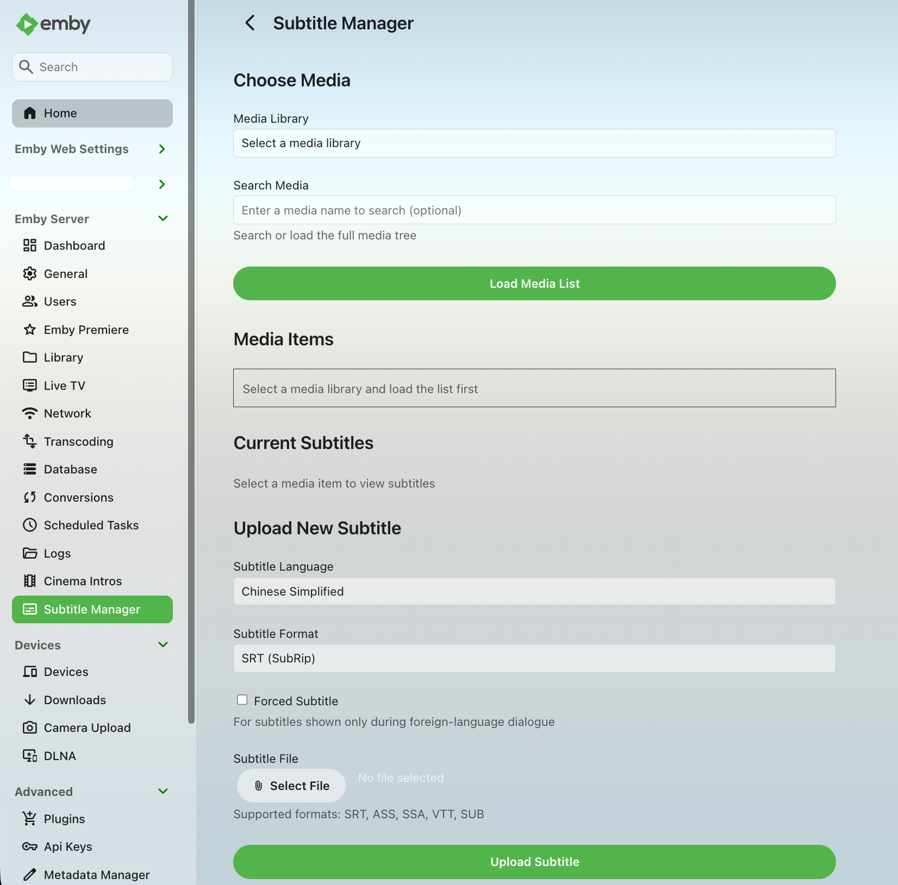

<p align="center">
  
</p>

# Emby Subtitle Manager

[](https://github.com/Kectai/Emby.SubtitleManager/actions/workflows/build.yml)

English | [Simplified Chinese](README.md)

Emby Subtitle Manager is an Emby Server plugin for viewing, uploading, and deleting external subtitle files from the Emby Web admin interface.

Uploaded subtitles are saved to the video's internal Emby metadata directory. After an upload or deletion, the plugin refreshes media metadata so Emby can detect the updated subtitle streams.

## Features

- Media library browsing: browse movies, series, seasons, folders, and extras videos in a hierarchical tree with paged loading.
- Media search: search media items by name using backend paged results.
- Subtitle viewing: view the language, path, external subtitle flag, and forced subtitle flag for selected videos.
- Subtitle upload: upload external subtitle files for selected videos, with language and forced subtitle options.
- Subtitle deletion: delete external subtitle files recognized by the selected video.
- Metadata refresh: refresh Emby media metadata after subtitle uploads or deletions.

## UI Language

Plugin page text and API messages follow Emby's preferred display language. Supported languages are Chinese Simplified, Chinese Traditional, Chinese Traditional (Hong Kong), English (United Kingdom), English (United States), Japanese, and Korean; unsupported languages fall back to English (United States).

The sidebar entry name is provided by Emby's plugin page registration and is usually refreshed when the plugin is loaded or the server is restarted.

## Screenshots

- The left sidebar entry uses Emby's built-in `subtitles` menu icon.
- The `Advanced - Plugins` page uses `icon.png` from this repository as the rectangular plugin thumbnail.

<p align="center">
  
</p>

## Requirements

- Emby Server 4.8.10 or a compatible version
- .NET SDK 6.0 or later for local builds
- Target framework: `netstandard2.1`

## Build

```bash
dotnet restore Emby.SubtitleManager.csproj
dotnet build Emby.SubtitleManager.csproj -c Release --no-restore
```

You can also use the helper script:

```bash
./scripts/build.sh
```

Build output:

```text
bin/Release/netstandard2.1/Emby.SubtitleManager.dll
```

For regular installation, download the published `Emby.SubtitleManager.dll` from [GitHub Releases](https://github.com/Kectai/Emby.SubtitleManager/releases/latest). GitHub Actions builds are manual only and mainly intended for development verification.

## Installation

For manual installation, copy the DLL to the `plugins` directory under the Emby Server Data Folder. The active data folder can be found in the Emby Server Dashboard under Server Info. See Emby's official [Server Data Folder](https://emby.media/support/articles/Server-Data-Folder.html) and [Plugins](https://emby.media/support/articles/Plugins.html) documentation for more details.

Common plugin directories:

```text
Windows: %APPDATA%\Emby-Server\programdata\plugins\
         C:\Users\{user}\AppData\Roaming\Emby-Server\programdata\plugins\
macOS:   /Users/{user}/emby-server/plugins/
         /Users/{user}/.config/emby-server/plugins/
Linux:   /var/lib/emby/plugins/
```

Installation steps:

1. Prefer downloading the latest `Emby.SubtitleManager.dll` from [Releases](https://github.com/Kectai/Emby.SubtitleManager/releases/latest); alternatively, build locally or use a GitHub Actions artifact for development builds.
2. Stop Emby Server, or make sure the old DLL is not locked when updating the plugin.
3. Copy the DLL to the `plugins` directory.
4. Start or restart Emby Server.
5. Open `Subtitle Manager` from the Emby Web main menu.

After updating the plugin, if Emby Web still shows the old page or old text, clear the browser cache or force-refresh the Emby Web page before opening the plugin again.

Linux example:

```bash
sudo cp bin/Release/netstandard2.1/Emby.SubtitleManager.dll /var/lib/emby/plugins/
sudo systemctl restart emby-server
```

Windows PowerShell example:

```powershell
Copy-Item bin\Release\netstandard2.1\Emby.SubtitleManager.dll "$env:APPDATA\Emby-Server\programdata\plugins\"
Restart-Service EmbyServer
```

## Usage

1. Sign in to Emby Web and open `Subtitle Manager`.
2. Select a media library.
3. Click `Load Media List`, or enter a keyword and search; use `Load more` when more results are available.
4. Select a movie, episode, or extras video from the media tree.
5. View existing subtitles, or choose a subtitle file and upload it.
6. Use the delete button to remove external subtitles.

Subtitle file naming:

```text
VideoFileName.language-code[.forced].format
```

Examples:

```text
Example.Movie.zh-Hans.srt
Example.Movie.zh-Hant.srt
Example.Movie.zh.srt
Example.Movie.en.srt
Example.Movie.zh-Hans.forced.srt
```

Subtitles are saved to Emby's metadata directory instead of the original media directory. This reduces the need for write access to media library folders and lets Emby manage subtitle stream detection.

Custom plugin pages are primarily intended for Emby Web. Some official mobile clients may not show the sidebar entry, or may ask you to configure the plugin from the local server web page.

## Permissions And Limits

- Media listing, upload, and delete APIs require an authenticated Emby administrator account. Non-admin users cannot retrieve media lists, upload subtitles, or delete subtitles.
- The page displays subtitle file paths, so use it only in trusted administrator environments and do not expose the Emby admin interface to untrusted networks.
- Backend subtitle format whitelist: `srt`, `ass`, `ssa`, `vtt`, `sub`.
- Backend language code validation accepts only standard language identifier formats.
- Uploaded files must not be empty and must be 20 MB or smaller.
- Existing subtitle files are not overwritten. Delete the old subtitle first when replacing one.
- The delete API prefers subtitle stream indexes and keeps the path parameter only as a compatibility fallback. It only removes external subtitles recognized by the selected media item and located inside that item's Emby metadata directory.

## API

These endpoints are intended for the plugin frontend. Permission rules are described in `Permissions And Limits`.

- `GET /SubtitleManager/Libraries`: returns media libraries. No parameters.
- `GET /SubtitleManager/Items`: returns media items. Parameters include `ParentId`, `IncludeItemTypes`, `Recursive`, `SearchTerm`, `StartIndex`, `Limit`, and `IncludeSubtitles`. Subtitle streams are omitted by default; use `IncludeSubtitles=true` to request subtitle information.
- `GET /SubtitleManager/Localization`: returns the language used by the plugin page. No parameters.
- `POST /SubtitleManager/Upload`: uploads a subtitle file. Query parameters include `ItemId`, `Language`, `Format`, and `IsForced`; the request body is the subtitle file stream.
- `POST /SubtitleManager/DeleteSubtitle`: deletes an external subtitle from the selected media item's metadata directory. Parameters include `ItemId` plus the preferred `SubtitleIndex` or compatibility fallback `SubtitlePath`.

## Project Structure

```text
.
├── .github/workflows/          # GitHub Actions build workflow
├── Api/                        # Backend REST API controller
├── Configuration/              # Emby Web plugin page
├── docs/images/                # README screenshot assets
├── scripts/                    # Local maintenance scripts
├── CHANGELOG.md                # Version history
├── Emby.SubtitleManager.csproj # .NET project file
├── LICENSE                     # MIT License
├── Plugin.cs                   # Plugin entry point and page registration
├── README.md                   # Simplified Chinese documentation
├── README.en.md                # English documentation
└── icon.png                    # Rectangular plugin thumbnail
```

Local build outputs and private notes such as `bin/`, `obj/`, `artifacts/`, `local-notes/`, and `.DS_Store` are excluded by `.gitignore`.

## Changelog

Version history is maintained in [CHANGELOG.md](CHANGELOG.md).

## License

This project is licensed under the MIT License. Unless otherwise stated, repository code, documentation, and icon assets are released under this license.

## AI Development Notice

The code, documentation, icon, and project organization for this repository were developed and completed by AI. Human involvement focused on requirements, testing, review, and project management.
