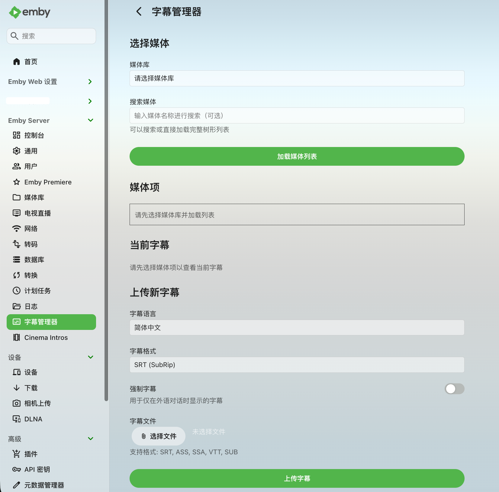

<p align="center">
  
</p>

# Emby Subtitle Manager

[](https://github.com/Kectai/Emby.SubtitleManager/actions/workflows/build.yml)

[English](README.en.md) | 简体中文

Emby Subtitle Manager 是一个 Emby Server 插件，用于在 Emby Web 管理界面中查看、上传和删除媒体项的外部字幕文件。

字幕会保存到媒体项的 Emby 内部元数据目录；上传或删除后，插件会刷新媒体元数据，让 Emby 重新识别字幕流。

## AI 开发说明

本项目的代码、文档、图标和项目整理均由 AI 开发并完成，人工主要负责提出需求、测试验收和后续管理。

## 功能

- 媒体库浏览：在插件页面按层级浏览电影、剧集、季、文件夹和 extras 视频，列表支持分页加载。
- 媒体搜索：按名称查找媒体项，搜索结果由后端分页返回。
- 字幕查看：查看选中视频已有字幕的语言、路径、外部字幕和强制字幕标记。
- 字幕上传：为选中视频上传外部字幕文件，并设置语言和强制字幕标记。
- 字幕删除：删除选中视频已识别的外部字幕文件。
- 元数据刷新：上传或删除字幕后刷新媒体元数据，让 Emby 重新识别字幕流。

## 界面语言

插件页面和接口提示跟随 Emby 首选显示语言，支持简体中文、繁体中文、繁体中文（香港）、English (United Kingdom)、English (United States)、日本語和한국어；其他语言回退为 English (United States)。

侧边栏入口名称由 Emby 插件页面注册信息提供，通常在插件加载或服务器重启后刷新。

## 界面展示

- 左侧主菜单入口使用 Emby 内置 `subtitles` 小图标。
- “高级 - 插件”页面使用仓库中的 `icon.png` 作为插件矩形缩略图。

<p align="center">
  
</p>

## 环境要求

- Emby Server 4.8.10 或兼容版本
- .NET SDK 6.0 或更高版本用于本地编译
- 目标框架：`netstandard2.1`

## 编译

```bash
dotnet restore Emby.SubtitleManager.csproj
dotnet build Emby.SubtitleManager.csproj -c Release --no-restore
```

也可以使用脚本：

```bash
./scripts/build.sh
```

编译产物：

```text
bin/Release/netstandard2.1/Emby.SubtitleManager.dll
```

普通安装建议优先从 [GitHub Releases](https://github.com/Kectai/Emby.SubtitleManager/releases/latest) 下载已发布的 `Emby.SubtitleManager.dll`。GitHub Actions 仅在手动触发时编译，产物主要用于开发验证。

## 安装

手动安装 Emby 插件时，DLL 应放在 Emby Server Data Folder 下的 `plugins` 子目录。可在 Emby Server Dashboard 的 Server Info 中查看当前数据目录；也可参考 Emby 官方的 [Server Data Folder](https://emby.media/support/articles/Server-Data-Folder.html) 和 [Plugins](https://emby.media/support/articles/Plugins.html) 说明。

常见插件目录：

```text
Windows: %APPDATA%\Emby-Server\programdata\plugins\
         C:\Users\{user}\AppData\Roaming\Emby-Server\programdata\plugins\
macOS:   /Users/{user}/emby-server/plugins/
         /Users/{user}/.config/emby-server/plugins/
Linux:   /var/lib/emby/plugins/
```

安装步骤：

1. 优先从 [Releases](https://github.com/Kectai/Emby.SubtitleManager/releases/latest) 下载最新 `Emby.SubtitleManager.dll`；也可自行编译或从 GitHub Actions artifact 获取开发构建。
2. 停止 Emby Server，或确保更新插件时 Emby Server 未占用旧 DLL。
3. 将 DLL 复制到 `plugins` 目录。
4. 启动或重启 Emby Server。
5. 在 Emby Web 主菜单中打开“字幕管理器”。

Linux 示例：

```bash
sudo cp bin/Release/netstandard2.1/Emby.SubtitleManager.dll /var/lib/emby/plugins/
sudo systemctl restart emby-server
```

Windows PowerShell 示例：

```powershell
Copy-Item bin\Release\netstandard2.1\Emby.SubtitleManager.dll "$env:APPDATA\Emby-Server\programdata\plugins\"
Restart-Service EmbyServer
```

## 使用

1. 登录 Emby Web，进入“字幕管理器”。
2. 选择媒体库。
3. 点击“加载媒体列表”，或输入关键词后搜索；当结果超过当前页时，可继续“加载更多”。
4. 在媒体树中选择电影、剧集或 extras 视频。
5. 查看当前字幕，或选择字幕文件后上传。
6. 对外部字幕可点击删除按钮移除。

字幕文件命名规则：

```text
视频文件名.语言代码[.forced].格式
```

示例：

```text
Example.Movie.zh-CN.srt
Example.Movie.en.srt
Example.Movie.zh.forced.srt
```

字幕保存到 Emby 元数据目录，而不是原始媒体目录。这样可以减少对媒体库文件夹写权限的依赖，也便于由 Emby 统一识别字幕流。

自定义插件页面主要面向 Emby Web。部分官方移动客户端可能不会展示侧边栏入口，或会提示回到本地服务器 Web 页面配置插件。

## 权限与限制

- 媒体列表、上传和删除接口要求已认证的 Emby 管理员账号；非管理员无法获取媒体列表，也无法上传或删除字幕。
- 页面会显示字幕文件路径，建议只在可信管理员环境中使用，不要把 Emby 管理端暴露给不可信网络。
- 后端限制字幕格式白名单：`srt`、`ass`、`ssa`、`vtt`、`sub`。
- 后端校验语言代码，只允许标准格式的语言标识。
- 上传文件不能为空，最大 20MB。
- 同名字幕不会被覆盖；需要替换时先删除旧字幕。
- 删除接口优先按字幕流索引定位外部字幕，路径参数仅作为兼容后备；最终只允许删除当前媒体项已识别、且位于该媒体 Emby 元数据目录内的外部字幕。

## API

这些接口主要供插件前端页面调用，权限规则见“权限与限制”。

- `GET /SubtitleManager/Libraries`：获取媒体库列表，无参数。
- `GET /SubtitleManager/Items`：获取媒体项列表，参数包含 `ParentId`、`IncludeItemTypes`、`Recursive`、`SearchTerm`、`StartIndex`、`Limit`、`IncludeSubtitles`；默认不携带字幕流，可用 `IncludeSubtitles=true` 请求字幕信息。
- `GET /SubtitleManager/Localization`：获取插件页面使用的语言，无参数。
- `POST /SubtitleManager/Upload`：上传字幕文件，查询参数包含 `ItemId`、`Language`、`Format`、`IsForced`，请求体为字幕文件流。
- `POST /SubtitleManager/DeleteSubtitle`：删除当前媒体项元数据目录中的外部字幕，参数包含 `ItemId`，以及优先使用的 `SubtitleIndex` 或兼容后备 `SubtitlePath`。

## 项目结构

```text
.
├── .github/workflows/          # GitHub Actions 编译流程
├── Api/                        # 后端 REST API 控制器
├── Configuration/              # Emby Web 插件页面
├── docs/images/                # README 截图资源
├── scripts/                    # 本地维护脚本
├── CHANGELOG.md                # 版本历史
├── Emby.SubtitleManager.csproj # .NET 项目文件
├── LICENSE                     # MIT 许可证
├── Plugin.cs                   # 插件入口和页面注册
├── README.md                   # 项目说明
├── README.en.md                # English documentation
└── icon.png                    # 插件列表矩形缩略图
```

`bin/`、`obj/`、`artifacts/`、`local-notes/`、`.DS_Store` 等本地产物已通过 `.gitignore` 排除。

## 版本历史

版本更新记录统一维护在 [CHANGELOG.md](CHANGELOG.md)。

## 许可证

本项目采用 MIT License。除非另有说明，仓库中的代码、文档和图标资源均按该许可证发布。
